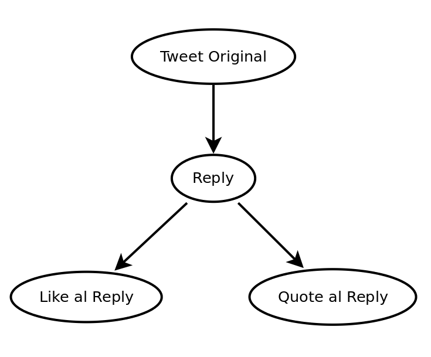

# Async Twitter

El Objetivo de este ejercicio es hacer uso del API de Twitter para:

- Publicar un nuevo tweet.
- Hacer un reply a ese tweet.
- Dar Like al reply de ese tweet.
- Hacer un retweet con quote del reply.

Para esto forzosamente tendremos que esperar a que el API de Twitter publique el tweet inicial, y nos devuelva la data del mismo para así conocer el id con el que fue publicado(requisito para poder realizar un reply), esto lo repetiremos en cada paso.

A excepción de los ultimos 2 pasos, donde ya contamos con el id del reply y por lo tanto podemos realizar las 2 acciones en paralelo.



## Herramientas
Para este ejercicio vamos a usar:

- El API de Twitter, especificamente la parte de [Post, retrieve and engage with Tweets](https://developer.twitter.com/en/docs/tweets/post-and-engage/api-reference/post-statuses-update).
- El paquete de  npm [Twitter](https://www.npmjs.com/package/twitter).
- NodeJs

## Inicialización
De ahora en delante en todos los proyectos encontrarás un [package.json](package.json), en él se almacenan todas las dependencias necesarias para correr el proyecto, gracias a él puedes simplemente ejecutar ```npm install``` desde la raíz del proyecto y todas las dependencias se instalarán automáticamente.

```
npm install
```

## Proceso

- Entra a [apps.twitter.com](https://apps.twitter.com/) y crea una nueva app, los permisos por defecto (Read/Write) son más que suficiente para esta prueba.

- En la sección Keys and Access Tokens encontrarás el ```consumer_key``` y el ```consumer_secret```, los necesitarás para llenar nuestro archivo de configuración.

- Al fondo encontrarás el botón nombrado Create access token, has click y Twitter te generará un ```access_token_key``` y un ```access_token_secret```, los necesitarás para llenar nuestro archivo de configuración.

Busca tu archivo [config.js](config.js) y reemplaza los valores por los tuyos
```
const client = new Twitter({
    consumer_key: '',
    consumer_secret: '',
    access_token_key: '',
    access_token_secret: ''
});
```

